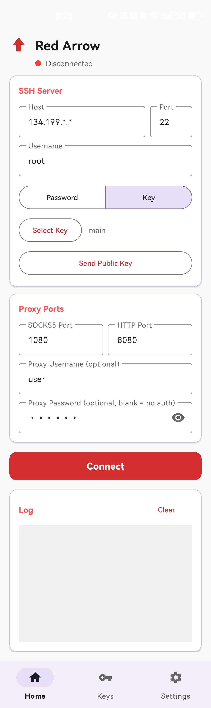
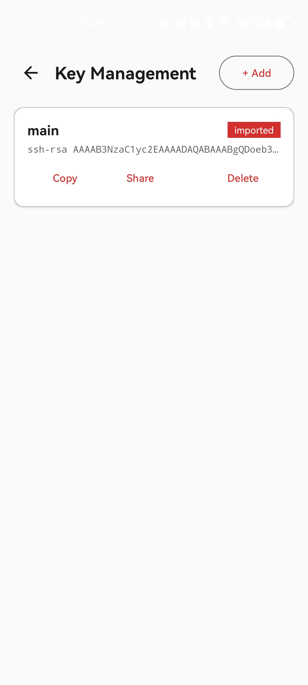
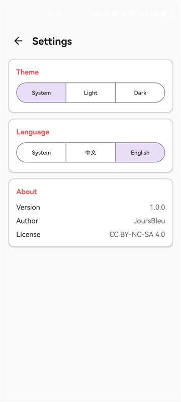

# Red Arrow

An Android app that creates local SOCKS5 and HTTP proxies over an SSH tunnel. All traffic is encrypted and forwarded through a remote SSH server.

## Screenshots

| Home | Keys | Settings |
|:---:|:---:|:---:|
|  |  |  |

## Features

- **SSH Tunnel** — Connect to a remote SSH server, encrypted tunnel through NAT
- **SOCKS5 Proxy** — Local SOCKS5 proxy (default `:1080`), listens on `0.0.0.0`
- **HTTP Proxy** — Local HTTP proxy (default `:8080`), listens on `0.0.0.0`
- **Proxy Authentication** — Optional username + password (SOCKS5 RFC 1929 / HTTP Basic)
- **SSH Auth** — Password and public key authentication
- **Key Management** — Generate Ed25519/RSA key pairs, import private keys, send public key to server
- **Auto-Reconnect** — Automatic reconnection with exponential backoff on disconnect
- **Health Check** — Periodic SSH session monitoring with automatic recovery
- **Traffic Stats** — Real-time upload/download byte counters
- **Foreground Service** — WakeLock keeps the tunnel alive
- **Live Log** — Real-time connection, proxy, and error logs
- **Active Connections** — Current proxy connections grouped by client IP
- **Theme** — Material Design 3, light / dark / system
- **i18n** — Chinese and English
- **Bottom Navigation** — Home / Keys / Settings
- **Auto Save** — Config persisted across restarts
- **Uninstall Cleanup** — All data stored in app-internal directory, auto-deleted on uninstall

## Usage

### 1. Install

Download APK from [Releases](https://github.com/JoursBleu/red-arrow/releases) or build from source.

### 2. Configure SSH Server

Enter host, port, username, and choose password or key authentication.

**Key Authentication Flow:**

1. Go to the **Keys** tab, generate an Ed25519/RSA key pair (or import an existing private key)
2. Back to **Home**, select the stored key
3. Tap **Send Public Key** to append it to the remote `~/.ssh/authorized_keys`
4. Now connect using key authentication

### 3. Connect

Tap **Connect**. Proxy info will be displayed:

```
SOCKS5  0.0.0.0:1080
HTTP    0.0.0.0:8080
```

Other devices on the LAN can use the phone's IP as the proxy address.

### 4. Proxy Auth (Optional)

Set username and password in the proxy section to enable SOCKS5/HTTP authentication. Leave blank for open access.

### 5. Background Running

> **Important**: To keep the tunnel alive long-term, allow background activity for the app:
>
> - **Xiaomi**: Settings → Apps → Manage apps → Red Arrow → Battery saver → No restrictions
> - **Huawei**: Settings → Battery → App launch → Red Arrow → Manage manually → Allow background
> - **OPPO/OnePlus**: Settings → Battery → More battery settings → Optimize battery usage → Red Arrow → Don't optimize
> - **Samsung**: Settings → Battery → Background usage limits → Remove Red Arrow
> - **Stock Android**: Settings → Apps → Red Arrow → Battery → Unrestricted

## Build

```bash
export ANDROID_HOME=/path/to/android-sdk
./gradlew assembleDebug
# APK: app/build/outputs/apk/debug/app-debug.apk
```

## Tech Stack

- **Language**: Kotlin
- **UI**: Material Design 3 + ViewBinding
- **SSH**: [mwiede/jsch](https://github.com/mwiede/jsch) 0.2.18
- **Async**: Kotlin Coroutines + StateFlow
- **Build**: Gradle 8.7, AGP 8.5.2, compileSdk 35, minSdk 26

## Architecture

```
MainActivity (Home)
├── SSH & proxy configuration
├── Connect / disconnect
├── Live log (AppLog → StateFlow)
└── Active connections (ConnectionTracker → StateFlow)

KeysActivity (Keys)
├── Generate Ed25519 / RSA key pairs
├── Import private key (auto-extract public key)
└── Copy / share public key, delete key

SettingsActivity (Settings)
├── Theme toggle (Light / Dark / System)
└── Language toggle (Chinese / English / System)

TunnelService (Foreground Service)
├── SSH connection (JSch) with auto-reconnect
├── Socks5Server (RFC 1929 auth)
├── HttpProxyServer (Basic auth)
├── ConnectionTracker
└── TrafficCounter

KeyStoreManager (Key Storage)
└── SharedPreferences + JSON
```

## Buy Me a Coffee ☕

`0x809EC3201f6bdFb3d428Ca7f0E10F3b55476a1c4` (ETH/ERC-20)

## License

Apache License 2.0
