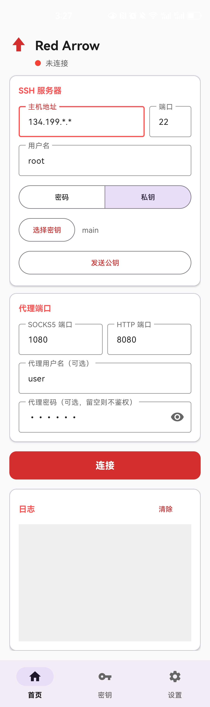
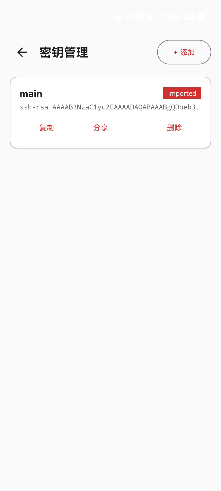
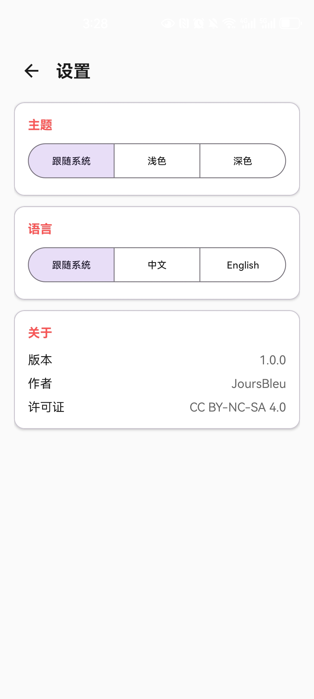

# Red Arrow

[English](README.md)

面向 **Android 与 Windows** 的开源 SSH 隧道代理。两个版本都提供本地 SOCKS5 与 HTTP 代理，并通过远程 SSH 服务器转发代理流量。

| 平台 | 下载 | 主要功能 |
|---|---|---|
| Windows 10/11 x64 | [安装器 1.2.2](https://github.com/JoursBleu/red-arrow/releases/download/windows-v1.2.2/RedArrow-Windows-Setup-1.2.2-x64.exe) | 原生控制中心、WinINET 系统代理、全局/绕过中国大陆模式、可选 ProxyJump |
| Android 8.0+ | [APK 测试版](https://github.com/JoursBleu/red-arrow/releases/download/v0.1.0-beta/app-debug.apk) | 前台服务、局域网代理共享、密码/密钥认证、流量统计 |

## 截图

### Windows

| 概览 | SSH 服务器 |
|:---:|:---:|
|  |  |

### Android

| 首页 | 密钥 | 设置 |
|:---:|:---:|:---:|
|  |  |  |

## 共有功能

- **SSH 隧道** — 连接远程 SSH 服务器，加密隧道穿透 NAT
- **双代理** — 提供本地 SOCKS5 与 HTTP 代理端点
- **密钥管理** — 生成或导入 SSH 密钥，并复制/安装公钥
- **断线重连** — SSH 断开后自动重连，指数退避策略

### Windows

- **系统代理** — 管理当前用户 WinINET 代理，停止或异常退出时恢复原有代理/PAC 设置
- **分流模式** — 仅本地、全局代理、使用内置 IPv4/IPv6 规则绕过中国大陆
- **自定义规则** — 强制直连域名/CIDR 与强制代理域名
- **可选 ProxyJump** — 可直连 SSH，也可填写 OpenSSH 跳板
- **本地监听** — 默认 SOCKS5 `127.0.0.1:1080`、HTTP `127.0.0.1:8118`
- **原生控制中心** — 状态、连接/断开、规则编辑、日志、代理测试及系统托盘
- **Ed25519 生成** — 生成专用密钥，不覆盖已有密钥文件

### Android

- **局域网共享** — SOCKS5 `:1080` 与 HTTP `:8080` 监听 `0.0.0.0`
- **代理鉴权** — 可选用户名 + 密码（SOCKS5 RFC 1929 / HTTP Basic）
- **SSH 认证** — 支持密码和公钥
- **连接健康检查** — 定时检测 SSH 会话存活，异常自动恢复
- **流量统计** — 实时上传/下载字节数计数
- **前台服务** — WakeLock 保活，隧道长时间稳定运行
- **实时日志** — 连接/代理/错误日志实时滚动显示
- **活跃连接** — 按客户端 IP 分组显示当前代理连接
- **日夜主题** — Material Design 3，浅色 / 深色 / 跟随系统
- **中英双语** — 中文和英文界面
- **底部导航** — 首页 / 密钥 / 设置
- **自动保存** — 配置持久化，重启无需重填
- **卸载清理** — 所有数据存储在应用内部目录，卸载自动删除

## 使用方法

### Windows 快速开始

1. 下载并运行 [`RedArrow-Windows-Setup-1.2.2-x64.exe`](https://github.com/JoursBleu/red-arrow/releases/download/windows-v1.2.2/RedArrow-Windows-Setup-1.2.2-x64.exe)。
2. 打开 Red Arrow，填写 SSH 地址、端口、用户与私钥；`ProxyJump` 可以留空。
3. 选择“仅本地代理”“绕过中国大陆”或“全局代理”，然后连接。
4. 遵循 Windows 系统代理的应用会自动生效；其他应用可手动使用 `127.0.0.1:1080` 或 `127.0.0.1:8118`。

> 安装器目前没有代码签名，Windows SmartScreen 可能提示未知发布者。

### Android 快速开始

#### 1. 安装

下载 [`app-debug.apk`](https://github.com/JoursBleu/red-arrow/releases/download/v0.1.0-beta/app-debug.apk)，或自行构建。

#### 2. 配置 SSH 服务器

填写主机地址、端口、用户名，选择密码或密钥认证。

**密钥认证流程：**

1. 进入「密钥」页面，生成 Ed25519/RSA 密钥对（或导入已有私钥）
2. 回到首页，选择已存储的密钥
3. 点击「发送公钥到服务器」，公钥追加到远程 `~/.ssh/authorized_keys`
4. 之后即可使用密钥认证连接

#### 3. 连接

点击「连接」，代理信息显示在界面上：

```
SOCKS5  0.0.0.0:1080
HTTP    0.0.0.0:8080
```

同一局域网内的其他设备可直接使用手机 IP 作为代理地址。

#### 4. 代理鉴权（可选）

在代理设置区域填写用户名和密码，即可为 SOCKS5/HTTP 代理启用认证。留空则不鉴权，任何人都可连接。

#### 5. 后台运行

> **重要**：为确保隧道长时间稳定运行，需要手动允许 App 后台活动：
>
> - **小米**: 设置 → 应用设置 → 应用管理 → Red Arrow → 省电策略 → 无限制
> - **华为**: 设置 → 电池 → 启动管理 → Red Arrow → 手动管理 → 允许后台活动
> - **OPPO/一加**: 设置 → 电池 → 更多电池设置 → 优化电池使用 → Red Arrow → 不优化
> - **vivo**: 设置 → 电池 → 后台高耗电 → 允许 Red Arrow
> - **三星**: 设置 → 电池 → 后台使用限制 → 移除 Red Arrow
> - **原生 Android**: 设置 → 应用 → Red Arrow → 电池 → 不受限

## 构建

### Android

```bash
export ANDROID_HOME=/path/to/android-sdk
./gradlew assembleDebug
# APK: app/build/outputs/apk/debug/app-debug.apk
```

### Windows

要求：Rust stable MSVC、Windows OpenSSH Client、Inno Setup 6。

```powershell
cd windows
.\build.ps1
# 产物：windows\dist\
```

## 技术栈

### Android

- **语言**: Kotlin
- **UI**: Material Design 3 + ViewBinding
- **SSH**: [mwiede/jsch](https://github.com/mwiede/jsch) 0.2.18
- **异步**: Kotlin Coroutines + StateFlow
- **构建**: Gradle 8.7, AGP 8.5.2, compileSdk 35, minSdk 26

### Windows

- **核心**: Rust
- **SSH**: Windows OpenSSH 动态转发
- **界面**: 原生 WinForms 控制中心
- **系统代理**: WinINET per-connection API
- **打包**: Inno Setup 6

## 架构

### Windows

```text
WinINET 应用
	-> HTTP 代理 127.0.0.1:8118
	-> 路由判断：DIRECT 或 SSH
	-> SOCKS5 127.0.0.1:1080
	-> OpenSSH 动态隧道
	-> 远程 SSH 服务器
```

### Android

```
MainActivity（首页）
├── SSH 配置 + 代理配置
├── 连接 / 断开控制
├── 实时日志（AppLog → StateFlow）
└── 活跃连接（ConnectionTracker → StateFlow）

KeysActivity（密钥）
├── 生成 Ed25519 / RSA 密钥对
├── 导入私钥文件（自动提取公钥）
└── 复制 / 分享公钥，删除密钥

SettingsActivity（设置）
├── 主题切换（浅色 / 深色 / 跟随系统）
└── 语言切换（中文 / English / 跟随系统）

TunnelService（前台服务）
├── SSH 连接（JSch）+ 断线重连
├── Socks5Server（RFC 1929 鉴权）
├── HttpProxyServer（Basic 鉴权）
├── ConnectionTracker（连接追踪）
└── TrafficCounter（流量统计）

KeyStoreManager（密钥存储）
└── SharedPreferences + JSON
```

## Buy Me a Coffee ☕

`0x809EC3201f6bdFb3d428Ca7f0E10F3b55476a1c4` (ETH/ERC-20)

## 许可证

Apache License 2.0
